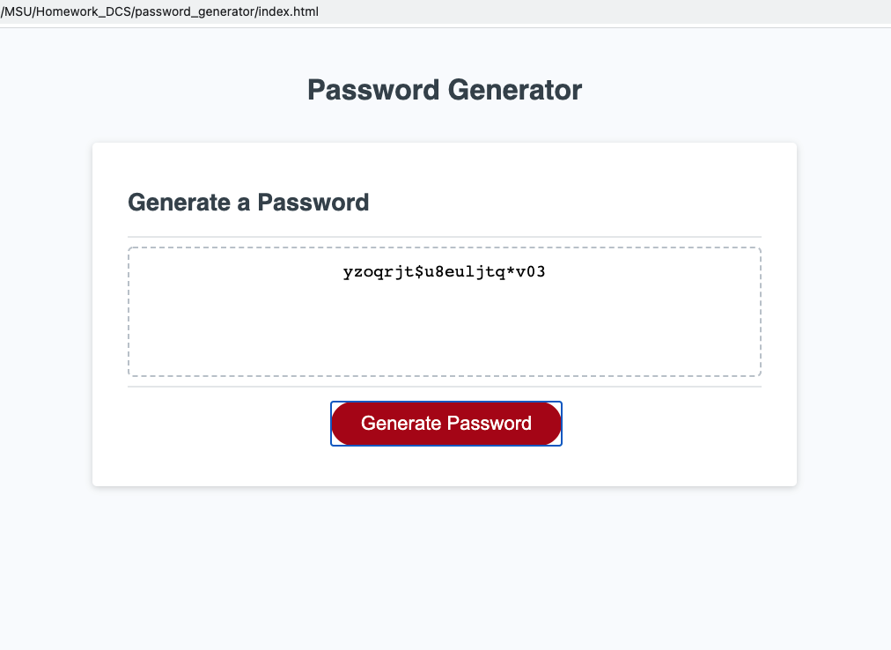

# pswd_generator

## Creating a Password Generator

​

This is the third assigment for MSU Coding Bootcamp; creating a password generator by writing the JavaScript code.

​

### Livepage Link
[Daniel Shoup's Password Generator Page](https://danshoup.github.io/password_generator/)

### Password Generator Screenshot

### Acceptance Criteria Summary

- a series of prompts for user to input password criteria

- a prompt for user to input desired password length

- a length of at least 8, and no more than 128, characters shoudl be allowed

- prompts for user to decide which character types to include

- user input is validated

- when all prompts are answered, a random password is generated that matches the user input criteria

- the generated password is displayed on the screen

### Other Criteria

- Console does not log erros in Chrome DevTools.

- Page is deployed at live URL.

- Page loads with no errors.

- GitHub URL submitted.

- GitHub repository contains appropriate code.

- User experience is intuitive and easy to navigate.

- User interface is clean and polished.

- Applicateion resembles the mock-up.

- Repository has a unique name, and follows best practices for naming conventions.

- Quality README.md file with a description, screenshot, and link to deployed app.

​

#### Dan's Notes:

I appreciate this project and feel better about my JavaScript abilities for having completed it.  I know I submitted late, also, but reiterate that Sunday has afforded me the time to get more of my projects done.  I will continue to update my projects because I learn more when I continue working on them, and realize that I can learn from writing different code to get the same application. 